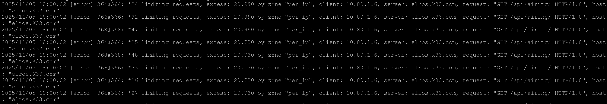
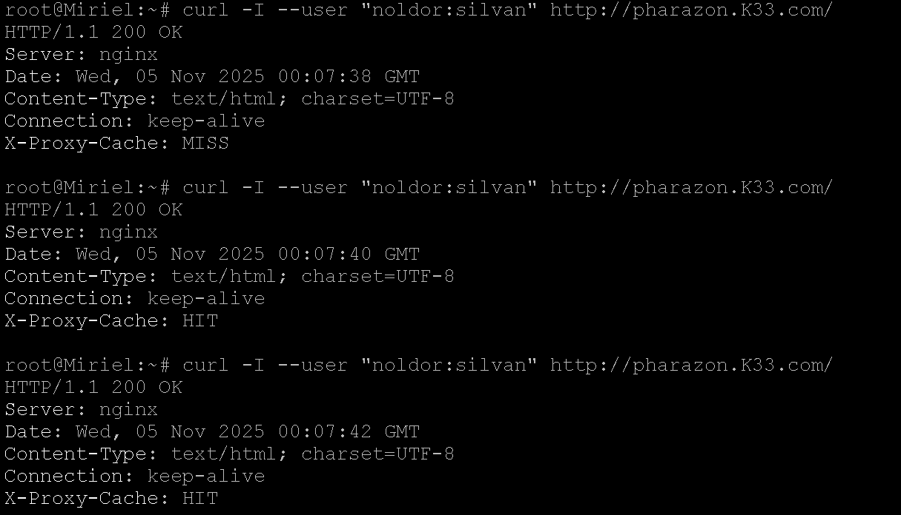

## Anggota Kelompok
| No | Nama                       | NRP         | Pembagian Tugas  |
|----|----------------------------|-------------|------------------|
| 1  | Aditya Reza Daffansyah     | 5027241034  | 1 - 10           | 
| 2  | I Gede Bagus Saka Sinatrya |	5027241088  | 11 - 20          | 

# Laporan Resmi Praktikum Jarkom

## Walkthrough Pengerjaan Praktikum Jarkom Modul 3
## Daftar Isi

- [Anggota Kelompok](#anggota-kelompok)
- [Daftar Isi](#daftar-isi)
- [Soal 1](#soal-1)
- [Soal 2](#soal-2)
- [Soal 3](#soal-3)
- [Soal 4](#soal-4)
- [Soal 5](#soal-5)
- [Soal 6](#soal-6)
- [Soal 7](#soal-7)
- [Soal 8](#soal-8)
- [Soal 9](#soal-9)
- [Soal 10](#soal-10)
- [Soal 11](#soal-11)
- [Soal 12](#soal-12)
- [Soal 13](#soal-13)
- [Soal 14](#soal-14)
- [Soal 15](#soal-15)
- [Soal 16](#soal-16)
- [Soal 17](#soal-17)
- [Soal 18](#soal-18)
- [Soal 19](#soal-19)
- [Soal 20](#soal-20)


### Soal 1
Di awal Zaman Kedua, setelah kehancuran Beleriand, para Valar menugaskan untuk membangun kembali jaringan komunikasi antar kerajaan. Para Valar menyalakan Minastir, Aldarion, Erendis, Amdir, Palantir, Narvi, Elros, Pharazon, Elendil, Isildur, Anarion, Galadriel, Celeborn, Oropher, Miriel, Amandil, Gilgalad, Celebrimbor, Khamul, dan pastikan setiap node (selain Durin sang penghubung antar dunia) dapat sementara berkomunikasi dengan Valinor/Internet (nameserver 192.168.122.1) untuk menerima instruksi awal.-
- edit config Durin
```
# config NAT1
auto eth0
iface eth0 inet dhcp

# config Switch1 
auto eth1
iface eth1 inet static
    address 10.80.1.1
    netmask 255.255.255.0

# config Switch2
auto eth2
iface eth2 inet static
    address 10.80.2.1
    netmask 255.255.255.0

# config Switch3 
auto eth3
iface eth3 inet static
    address 10.80.3.1
    netmask 255.255.255.0

# config Switch4
auto eth4
iface eth4 inet static
    address 10.80.4.1
    netmask 255.255.255.0

# config Switch5 (Minastir)
auto eth5
iface eth5 inet static
    address 10.80.5.1
    netmask 255.255.255.0
```

- NAT Configuration
```
apt-get update && apt-get install -y iptables
iptables -t nat -A POSTROUTING -o eth0 -j MASQUERADE
```

- Subnet 1 (10.80.1.X)
```
# elendil (Laravel Worker 1)
# isildur (Laravel Worker 2)
# anarion (Laravel Worker 3)
# miriel  (Client Static 1)
# elros   (Load Balancer Laravel)
# amandil (Client Dinamis 2)

auto eth0
iface eth0 inet static
    address 10.80.1.X    # Ganti X sesuai tabel di bawah
    netmask 255.255.255.0
    gateway 10.80.1.1
    up echo nameserver 192.168.122.1 > /etc/resolv.conf
```

- Subnet 2 (10.80.2.X)
```
# galadriel (PHP Worker 1)
# celeborn (PHP Worker 2)
# oropher (PHP Worker 3)
# celebrimbor (Client Static 2)
# pharazon (Load Balancer PHP)
# gilgalad (Client Dinamis 1)

auto eth0
iface eth0 inet static
    address 10.80.2.X    # Ganti X sesuai tabel di bawah
    netmask 255.255.255.0
    gateway 10.80.2.1
    up echo nameserver 192.168.122.1 > /etc/resolv.conf

```

- Subnet 3 (10.80.3.X)
```
# erendis (DNS Master)
# amdir   (DNS Slave)
# khamul  (Client Fixed DHCP Address)

auto eth0
iface eth0 inet static
    address 10.80.3.X    # Ganti X sesuai tabel di bawah
    netmask 255.255.255.0
    gateway 10.80.3.1
    up echo nameserver 192.168.122.1 > /etc/resolv.conf
```

- Subnet 4 (10.80.4.X)
```
# aldarion (DHCP Server)
# palantir (Database Server)
# narvi (Database Slave)

auto eth0
iface eth0 inet static
    address 10.80.4.X    # Ganti X sesuai tabel di bawah
    netmask 255.255.255.0
    gateway 10.80.4.1
    up echo nameserver 192.168.122.1 > /etc/resolv.conf
```

- Subnet 5 (10.80.5.X)
```
# minastir (DNS Forwarder)

auto eth0
iface eth0 inet static
    address 10.80.5.2
    netmask 255.255.255.0
    gateway 10.80.5.1
    up echo nameserver 192.168.122.1 > /etc/resolv.conf
```
- Testing ping sederhana


### Soal 2
Raja Pelaut Aldarion, penguasa wilayah Númenor, memutuskan cara pembagian tanah client secara dinamis. Ia menetapkan:
Client Dinamis Keluarga Manusia: Mendapatkan tanah di rentang [prefix ip].1.6 - [prefix ip].1.34 dan [prefix ip].1.68 - [prefix ip].1.94.
Client Dinamis Keluarga Peri: Mendapatkan tanah di rentang [prefix ip].2.35 - [prefix ip].2.67 dan [prefix ip].2.96 - [prefix ip].2.121.
Khamul yang misterius: Diberikan tanah tetap di [prefix ip].3.95, agar keberadaannya selalu diketahui. Pastikan Durin dapat menyampaikan dekrit ini ke semua wilayah yang terhubung dengannya.

- di aldarion (DHCP Server)
```
apt-get update
apt-get install -y isc-dhcp-server
```

- konfigurasi interface di /etc/default/isc-dhcp-server
```
cat <<EOF > /etc/default/isc-dhcp-server
INTERFACESv4="eth0"
INTERFACESv6=""
EOF
```

- Konfigurasi DHCP
```
cat <<EOF > /etc/dhcp/dhcpd.conf
authoritative;

# Subnet 1 - Client Dinamis Keluarga Manusia
subnet 10.80.1.0 netmask 255.255.255.0 {
    range 10.80.1.6 10.80.1.34;
    range 10.80.1.68 10.80.1.94;
    option routers 10.80.1.1;
    option broadcast-address 10.80.1.255;
    option domain-name-servers 192.168.122.1;
}

# Subnet 2 - Client Dinamis Keluarga Peri
subnet 10.80.2.0 netmask 255.255.255.0 {
    range 10.80.2.35 10.80.2.67;
    range 10.80.2.96 10.80.2.121;
    option routers 10.80.2.1;
    option broadcast-address 10.80.2.255; 
    option domain-name-servers 192.168.122.1;
}

# Subnet 3 - Area Khamul
subnet 10.80.3.0 netmask 255.255.255.0 {
    option routers 10.80.3.1;
    option broadcast-address 10.80.3.255;
}

# Subnet dimana Aldarion berada (sesuaikan!)
subnet 10.80.4.0 netmask 255.255.255.0 {
}

# Fixed Address untuk Khamul
host Khamul {
    hardware ethernet 02:42:4c:ce:39:00; 
    fixed-address 10.80.3.95;
}
EOF
# aa:bb:cc:dd ..., diisi dengan 
# mac address dengan ifconfig di Khamul
```
- Restart service

`service isc-dhcp-server restart`

- di Durin (DHCP Relay)
```
apt-get update
apt-get install -y isc-dhcp-relay
```

- Edit config relay
```
cat <<EOF > /etc/default/isc-dhcp-relay
SERVERS="10.80.4.2"
INTERFACES="eth1 eth2 eth3 eth4 eth5"
OPTIONS=""
EOF
```

- Edit congig systcl
```
cat <<EOF > /etc/sysctl.conf
net.ipv4.ip_forward=1
EOF
```
- Restart relay
```
service isc-dhcp-relay restart
```

- Ubah client menjadi dinamis
```
cat <<EOF > /etc/network/interfaces
auto eth0
iface eth0 inet dhcp
EOF
```

- Test di Khamul (fixed-address)
```
ip a
# harusnya 10.80.3.95
```

- Tes di Amandil (dynamic-2)
```
ip a
# harus dalam range yang ada
```


### Soal 3
Untuk mengontrol arus informasi ke dunia luar (Valinor/Internet), sebuah menara pengawas, Minastir didirikan. Minastir mengatur agar semua node (kecuali Durin) hanya dapat mengirim pesan ke luar Arda setelah melewati pemeriksaan di Minastir.

- di Minastir (DNS Forwarder)
```
apt-get update
apt-get install -y bind9

ln -s /etc/init.d/named /etc/init.d/bind9
```

- Konfigurasi BIND9 sebagai Forwarder
```
cat <<EOF > /etc/bind/named.conf.options
options {
    directory "/var/cache/bind";

    // Izinkan query dari jaringan internal kita (10.80.x.x)
    allow-query { 10.80.0.0/16; localhost; localnets; };
    
    // Izinkan recursi (forwarding) untuk jaringan internal kita
    allow-recursion { 10.80.0.0/16; localhost; localnets; };

    // Forward semua request ke DNS GNS3
    forwarders {
        192.168.122.1;
    };
    forward only; // Hanya forward, jangan coba resolve sendiri

    dnssec-validation auto;
    listen-on-v6 { any; };
};
EOF
```
- Restart service bind9

`service bind9 restart`

- di Aldarion (UPDATE DHCP Server)
Ubah DNS server yang dibagikan ke klien.
Sebelumnya: 192.168.122.1
Sekarang: 10.80.5.2 (IP Minastir)

- Config dhcp config
```
cat <<EOF > /etc/dhcp/dhcpd.conf
# Opsi global
authoritative;
option domain-name-servers 10.80.5.2;

# subnet 1 - Client Dinamis Keluarga Manusia
subnet 10.80.1.0 netmask 255.255.255.0 {
    range 10.80.1.6 10.80.1.34;
    range 10.80.1.68 10.80.1.94;
    option routers 10.80.1.1;
    option broadcast-address 10.80.1.255;
}

# subnet 2 - Client Dinamis Keluarga Peri
subnet 10.80.2.0 netmask 255.255.255.0 {
    range 10.80.2.35 10.80.2.67;
    range 10.80.2.96 10.80.2.121;
    option routers 10.80.2.1;
    option broadcast-address 10.80.2.255; 
}

# subnet 3 - Area Khamul
subnet 10.80.3.0 netmask 255.255.255.0 {
    option routers 10.80.3.1;
    option broadcast-address 10.80.3.255;
    # Baris DNS dipindah ke global
}

# subnet 4 - (Wajib ada agar service jalan)
subnet 10.80.4.0 netmask 255.255.255.0 {
}

# Fixed Address untuk Khamul (MAC Address dari log Anda)
host Khamul {
    hardware ethernet 02:42:4c:ce:39:00; 
    fixed-address 10.80.3.95;
}
EOF
```

- Ganti nameserver semua client statis
```
cat <<EOF > /etc/resolv.conf
nameserver 10.80.5.2
nameserver 10.80.3.2
nameserver 10.80.3.3
nameserver 192.168.122.1
EOF
```

- Restart dhcp server

`service isc-dhcp-server restart`

- restart node di Gilgalad, Amandil, dan Khamul 


- Testing di node statis
```
dig google.com
# harusnya servernya bakal ke forward ke 10.80.5.2  
```

- Testing di node dinamis
```
cat /etc/resolv.conf
dig google.com
# harusnya servernya bakal ke forward ke 10.80.5.2  
```


### Soal 4
Ratu Erendis, sang pembuat peta, menetapkan nama resmi untuk wilayah utama (<xxxx>.com). Ia menunjuk dirinya (ns1.<xxxx>.com) dan muridnya Amdir (ns2.<xxxx>.com) sebagai penjaga peta resmi. Setiap lokasi penting (Palantir, Elros, Pharazon, Elendil, Isildur, Anarion, Galadriel, Celeborn, Oropher) diberikan nama domain unik yang menunjuk ke lokasi fisik tanah mereka. Pastikan Amdir selalu menyalin peta (master-slave) dari Erendis dengan setia.

- di Erendis (DNS Master)
```
apt-get update
apt-get install -y bind9

ln -s /etc/init.d/named /etc/init.d/bind9
```
- Konfig Bind9 untuk mendefinisikan zone, Erendis sebagai master, izinkan Amdir untuk transfer
```
cat <<EOF > /etc/bind/named.conf.local
zone "K33.com" {
    type master;
    file "/etc/bind/db.K33.com";
    allow-transfer { 10.80.3.3; };
};
EOF
```

- Membuat "Peta" (Zone File) untuk K33.com
```
cat <<EOF > /etc/bind/db.K33.com
\$TTL    604800
@       IN      SOA     ns1.K33.com. root.K33.com. (
                              2         ; Serial
                         604800         ; Refresh
                          86400         ; Retry
                        2419200         ; Expire
                         604800 )       ; Negative Cache TTL
;
; Name Servers
@       IN      NS      ns1.K3A3.com.
@       IN      NS      ns2.K33.com.

; Name Server A Records
ns1     IN      A       10.80.3.2       ; Erendis
ns2     IN      A       10.80.3.3       ; Amdir

; A Records untuk Lokasi Penting (Soal 4)
Palantir  IN      A       10.80.4.3
Elros     IN      A       10.80.1.6
Pharazon  IN      A       10.80.2.6
Elendil   IN      A       10.80.1.2
Isildur   IN      A       10.80.1.3
Anarion   IN      A       10.80.1.4
Galadriel IN      A       10.80.2.2
Celeborn  IN      A       10.80.2.3
Oropher   IN      A       10.80.2.4
EOF
```

- Restart service bind9

`service bind9 restart`

- di Amdir (DNS Slave)
```
apt-get update
apt-get install -y bind9

ln -s /etc/init.d/named /etc/init.d/bind9
```

- Konfigurasi BIND9 untuk menjadi "Slave"
```
cat <<EOF > /etc/bind/named.conf.local
zone "K33.com" {
    type slave;
    masters { 10.80.3.2; };
    file "/var/lib/bind/db.K33.com";
};
EOF
```
- Restart service bind9

`service bind9 restart`

- di Minastir (DNS Forwarder) 
```
cat <<EOF >> /etc/bind/named.conf.local

zone "K33.com" {
    type forward;
    forward only;
    forwarders { 10.80.3.2; 10.80.3.3; };
};
EOF
```

- Restart service bind9

`service bind9 restart`

- Tes dari client manapun:
```
# 1. Tes ping ke nama domain
ping elendil.K33.com -c 4
# ... Harusnya merespons dari 10.80.1.2

ping palantir.K33.com -c 4
# ... Harusnya merespons dari 10.80.4.3
```


### Soal 5
Untuk memudahkan, nama alias www.<xxxx>.com dibuat untuk peta utama <xxxx>.com. Reverse PTR juga dibuat agar lokasi Erendis dan Amdir dapat dilacak dari alamat fisik tanahnya. Erendis juga menambahkan pesan rahasia (TXT record) pada petanya: "Cincin Sauron" yang menunjuk ke lokasi Elros, dan "Aliansi Terakhir" yang menunjuk ke lokasi Pharazon. Pastikan Amdir juga mengetahui pesan rahasia ini.

- di Erendis (DNS Master), tambahkan reverse zone
```
cat <<EOF >> /etc/bind/named.conf.local
zone "3.80.10.in-addr.arpa" {
    type master;
    file "/etc/bind/db.10.80.3";
    allow-transfer { 10.80.3.3; }; // Izinkan Amdir menyalin
};
EOF
```

- Tambahkan CNAME TXT dan file zone 
```
cat <<EOF > /etc/bind/db.K33.com
\$TTL    604800
@       IN      SOA     ns1.K33.com. root.K33.com. (
                              3         ; Serial 
                         604800         ; Refresh
                          86400         ; Retry
                        2419200         ; Expire
                         604800 )       ; Negative Cache TTL
;
; Name Servers
@       IN      NS      ns1.K33.com.
@       IN      NS      ns2.K33.com.

; Name Server A Records
ns1     IN      A       10.80.3.2       ; Erendis
ns2     IN      A       10.80.3.3       ; Amdir

; Alias CNAME
www     IN      CNAME   K33.com.

; TXT Records
Elros     IN      TXT     "Cincin Sauron"
Pharazon  IN      TXT     "Aliansi Terakhir"
; -----------------------

; A Records 
Palantir  IN      A       10.80.4.3
Elros     IN      A       10.80.1.6
Pharazon  IN      A       10.80.2.6
Elendil   IN      A       10.80.1.2
Isildur   IN      A       10.80.1.3
Anarion   IN      A       10.80.1.4
Galadriel IN      A       10.80.2.2
Celeborn  IN      A       10.80.2.3
Oropher   IN      A       10.80.2.4
EOF
```

- Buat reverse zone baru
```
cat <<EOF > /etc/bind/db.10.80.3
\$TTL    604800
@       IN      SOA     ns1.K33.com. root.K33.com. (
                              1         ; Serial
                         604800         ; Refresh
                          86400         ; Retry
                        2419200         ; Expire
                         604800 )       ; Negative Cache TTL
;
@       IN      NS      ns1.K33.com.
@       IN      NS      ns2.K33.com.

; PTR Records (dibalik)
2       IN      PTR     ns1.K33.com.    ; 10.80.3.2
3       IN      PTR     ns2.K33.com.    ; 10.80.3.3
EOF

service bind9 restart

# di Amdir (DNS Slave)
# (Kita asumsikan bind9 sudah terinstal dari Soal 4)

# 1. MENIMPA Konfigurasi Zone di named.conf.local
#    Kita tambahkan reverse zone "3.80.10.in-addr.arpa"
#    sebagai slave dari Erendis (10.80.3.2)
cat <<EOF >> /etc/bind/named.conf.local
zone "3.80.10.in-addr.arpa" {
    type slave;
    masters { 10.80.3.2; };
    file "/var/lib/bind/db.10.80.3";
};
EOF
```
- Restart service bind9

`service bind9 restart`

- di Minastir (DNS Forwarder), tambahkan reverse zone ke conf local
```
cat <<EOF >> /etc/bind/named.conf.local
zone "3.80.10.in-addr.arpa" {
    type forward;
    forward only;
    forwarders { 10.80.3.2; 10.80.3.3; };
};
EOF
```

- Restart bind9

`service bind9 restart`

- Testing 
```
# 1. Tes CNAME
dig www.K33.com
# ... Di ANSWER SECTION, Anda akan melihat:
# ... www.K33.com.    ...  IN  CNAME   K33.com.
# ... K33.com.        ...  IN  A       ... (IP K33.com, jika ada)

# 2. Tes TXT Record
dig elros.K33.com TXT
# ... Di ANSWER SECTION, Anda akan melihat:
# ... elros.K33.com.  ...  IN  TXT     "Cincin Sauron"

dig pharazon.K33.com TXT
# ... Di ANSWER SECTION, Anda akan melihat:
# ... pharazon.K33.com. ...  IN  TXT     "Aliansi Terakhir"

# 3. Tes Reverse PTR
dig -x 10.80.3.2
# ... Di ANSWER SECTION, Anda akan melihat:
# ... 2.3.80.10.in-addr.arpa. ... IN PTR ns1.K33.com.
```


### Soal 6
Aldarion menetapkan aturan waktu peminjaman tanah. Ia mengatur:
Client Dinamis Keluarga Manusia dapat meminjam tanah selama setengah jam.
Client Dinamis Keluarga Peri hanya seperenam jam.
Batas waktu maksimal peminjaman untuk semua adalah satu jam.

- di Aldarion (DHCP Server), tambahkan lease time
```
cat <<EOF > /etc/dhcp/dhcpd.conf
authoritative;
option domain-name-servers 10.80.5.2;

# subnet 1 - Client Dinamis Keluarga Manusia
subnet 10.80.1.0 netmask 255.255.255.0 {
    range 10.80.1.6 10.80.1.34;
    range 10.80.1.68 10.80.1.94;
    option routers 10.80.1.1;
    option broadcast-address 10.80.1.255;

    default-lease-time 1800;    # 30 menit
    max-lease-time 3600;        # 1 jam
}

# subnet 2 - Client Dinamis Keluarga Peri
subnet 10.80.2.0 netmask 255.255.255.0 {
    range 10.80.2.35 10.80.2.67;
    range 10.80.2.96 10.80.2.121;
    option routers 10.80.2.1;
    option broadcast-address 10.80.2.255; 

    default-lease-time 600;    # 10 menit
    max-lease-time 3600;       # 1 jam
}

# subnet 3 - Area Khamul
subnet 10.80.3.0 netmask 255.255.255.0 {
    option routers 10.80.3.1;
    option broadcast-address 10.80.3.255;

    default-lease-time 1800;    # 30 menit
    max-lease-time 3600;        # 1 jam
}

# subnet 4 
subnet 10.80.4.0 netmask 255.255.255.0 {
}

# Fixed Address untuk Khamul
host Khamul {
    hardware ethernet 02:42:4c:ce:39:00; 
    fixed-address 10.80.3.95;
}
EOF
```

- restart service 

`service isc-dhcp-server restart`

- restart client khamul amandil dan gilgalad lewat gns

- test di Aldarion

`cat /var/lib/dhcp/dhcpd.leases`


### Soal 7
Para Ksatria Númenor (Elendil, Isildur, Anarion) mulai membangun benteng pertahanan digital mereka menggunakan teknologi Laravel. Instal semua tools yang dibutuhkan (php8.4, composer, nginx) dan dapatkan cetak biru benteng dari Resource-laravel di setiap node worker Laravel. Cek dengan lynx di client.

- di Elendil, Isildur, DAN Anarion (Worker Laravel)
- Instalasi semua tools
```
apt-get update
apt-get install -y nginx git composer \
                   php8.4-fpm php8.4-mysql php8.4-mbstring \
                   php8.4-xml php8.4-curl php8.4-zip
```

- Dapatkan "Blue Print" (Source Code Laravel)

`git clone https://github.com/elshiraphine/laravel-simple-rest-api /var/www/laravel`

- Pindah ke direktori Laravel

`cd /var/www/laravel`

- Instal dependensi Laravel
```
composer update 
composer install --no-dev --optimize-autoloader
```

- Siapkan file environment

`cp .env.example .env`

- Generate kunci aplikasi Laravel

`php artisan key:generate`


- Atur izin folder
```
chown -R www-data:www-data /var/www/laravel/storage /var/www/laravel/bootstrap/cache
chmod -R 775 /var/www/laravel/storage /var/www/laravel/bootstrap/cache
```

- Jalankan service
```
service php8.4-fpm start
service nginx start
```

- di node Klien 
- Instal lynx
```
apt-get update
apt-get install -y lynx
```

- Testing di Client
```
# Cek Elendil
lynx http://elendil.K33.com
# Cek Isildur
lynx http://isildur.K33.com
# Cek Anarion
lynx http://anarion.K33.com

# Hasil yang diharapkan:
# Ketiganya akan menampilkan halaman default "Welcome to nginx!"
# Ini membuktikan Nginx jalan dan DNS (Soal 4/5) berfungsi.
```


### Soal 8
Setiap benteng Númenor harus terhubung ke sumber pengetahuan, Palantir. Konfigurasikan koneksi database di file .env masing-masing worker. Setiap benteng juga harus memiliki gerbang masuk yang unik; atur nginx agar Elendil mendengarkan di port 8001, Isildur di 8002, dan Anarion di 8003. Jangan lupa jalankan migrasi dan seeding awal dari Elendil. Buat agar akses web hanya bisa melalui domain nama, tidak bisa melalui ip.

- di palantir (database server)
- instal mariaDB server
```
apt-get update
apt-get install -y mariadb-server
```

- konfigurasi agar bisa diakses dari node lain (worker)

`sed -i "s/bind-address\s*=\s*127.0.0.1/bind-address = 0.0.0.0/" /etc/mysql/mariadb.conf.d/50-server.cnf`

- Restart mariadb

`service mariadb restart`

- setup database dan user
```
mysql -u root <<EOF
CREATE DATABASE laravel_db;
CREATE USER 'laravel_user'@'10.80.1.%' IDENTIFIED BY 'JarkomSuram';
GRANT ALL PRIVILEGES ON laravel_db.* TO 'laravel_user'@'10.80.1.%';
FLUSH PRIVILEGES;
EOF
```

- di elendil (worker 1 - port 8001)
- konfigurasi koneksi database .env
```
cd /var/www/laravel
sed -i "s/DB_HOST=127.0.0.1/DB_HOST=10.80.4.3/" .env
sed -i "s/DB_DATABASE=laravel/DB_DATABASE=laravel_db/" .env
sed -i "s/DB_USERNAME=root/DB_USERNAME=laravel_user/" .env
sed -i "s/DB_PASSWORD=/DB_PASSWORD=JarkomSuram/" .env
```

- konfigurasi nginx untuk port 8001
```
cat <<EOF > /etc/nginx/sites-available/laravel
server {
    listen 8001;
    server_name elendil.K33.com;

    root /var/www/laravel/public;
    index index.php index.html;

    location / {
        try_files \$uri \$uri/ /index.php?\$query_string;
    }

    location ~ \.php$ {
        include snippets/fastcgi-php.conf;
        fastcgi_pass unix:/var/run/php/php8.4-fpm.sock;
    }
}

# server block untuk menolak akses via ip (soal 8)
server {
    listen 8001 default_server;
    server_name _;
    return 404; # atau 403
}
EOF
```

- aktifkan site dan hapus link default
```
ln -s /etc/nginx/sites-available/laravel /etc/nginx/sites-enabled/
rm /etc/nginx/sites-enabled/default
```

- jalankan migrasi dan seeding (hanya di elendil)
```
php artisan migrate:fresh --seed
service nginx restart
```

- di isildur (worker 2 - port 8002)
- konfigurasi koneksi database .env
```
cd /var/www/laravel
sed -i "s/DB_HOST=127.0.0.1/DB_HOST=10.80.4.3/" .env
sed -i "s/DB_DATABASE=laravel/DB_DATABASE=laravel_db/" .env
sed -i "s/DB_USERNAME=root/DB_USERNAME=laravel_user/" .env
sed -i "s/DB_PASSWORD=/DB_PASSWORD=JarkomSuram/" .env
```

- konfigurasi nginx untuk port 8002
```
cat <<EOF > /etc/nginx/sites-available/laravel
server {
    listen 8002;
    server_name isildur.K33.com;

    root /var/www/laravel/public;
    index index.php index.html;

    location / {
        try_files \$uri \$uri/ /index.php?\$query_string;
    }

    location ~ \.php$ {
        include snippets/fastcgi-php.conf;
        fastcgi_pass unix:/var/run/php/php8.4-fpm.sock;
    }
}

# server block untuk menolak akses via ip
server {
    listen 8002 default_server;
    server_name _;
    return 404;
}
EOF
```

- aktifkan site dan hapus link default
```
ln -s /etc/nginx/sites-available/laravel /etc/nginx/sites-enabled/
rm /etc/nginx/sites-enabled/default
```

- generate key dan restart service nginx
```
php artisan key:generate
service nginx restart
```

- di anarion (worker 3 - port 8003)
- konfigurasi koneksi database .env
```
cd /var/www/laravel
sed -i "s/DB_HOST=127.0.0.1/DB_HOST=10.80.4.3/" .env
sed -i "s/DB_DATABASE=laravel/DB_DATABASE=laravel_db/" .env
sed -i "s/DB_USERNAME=root/DB_USERNAME=laravel_user/" .env
sed -i "s/DB_PASSWORD=/DB_PASSWORD=JarkomSuram/" .env
```

- konfigurasi nginx untuk port 8003
```
cat <<EOF > /etc/nginx/sites-available/laravel
server {33333
    listen 8003;
    server_name anarion.K33.com;

    root /var/www/laravel/public;
    index index.php index.html;

    location / {
        try_files \$uri \$uri/ /index.php?\$query_string;
    }

    location ~ \.php$ {
        include snippets/fastcgi-php.conf;
        fastcgi_pass unix:/var/run/php/php8.4-fpm.sock;
    }
}

# server block untuk menolak akses via ip
server {
    listen 8003 default_server;
    server_name _;
    return 404;
}
EOF
```

- aktifkan site dan hapus link default
```
ln -s /etc/nginx/sites-available/laravel /etc/nginx/sites-enabled/
rm /etc/nginx/sites-enabled/default
```

- generate key dan restart service
```
php artisan key:generate
service nginx restart
```


### Soal 9
Pastikan setiap benteng berfungsi secara mandiri. Dari dalam node client masing-masing, gunakan lynx untuk melihat halaman utama Laravel dan curl /api/airing untuk memastikan mereka bisa mengambil data dari Palantir.

- di node klien 
```
apt-get update
apt-get install -y curl
```

- test
```
# --- Tes Elendil (Port 8001) ---

# tes 1: halaman utama laravel (dengan lynx)
lynx http://elendil.K33.com:8001
# hasil yang diharapkan:
# lynx akan menampilkan halaman web laravel (bukan 'welcome to nginx')

# tes 2: api (koneksi database)
curl http://elendil.K33.com:8001/api/airing
# hasil yang diharapkan:
# anda akan melihat output JSON yang berisi daftar data, contoh:
# {"data":[{"id":1,"title":"Judul Anime","status":"Airing",...}, ...]}

# --- Tes Isildur (Port 8002) ---

# tes 1: halaman utama laravel
lynx http://isildur.K33.com:8002

# tes 2: api (koneksi database)
curl http://isildur.K33.com:8002/api/airing
# hasil yang diharapkan:
# output JSON yang sama seperti elendil

# --- Tes Anarion (Port 8003) ---

# tes 1: halaman utama laravel
lynx http://anarion.K33.com:8003

# tes 2: api (koneksi database)
curl http://anarion.K33.com:8003/api/airing
# hasil yang diharapkan:
# output JSON yang sama seperti elendil

# --- Tes Tambahan (Soal 8: Blokir IP) ---

# tes 3: akses via ip (harus gagal)
curl http://10.80.1.2:8001
# hasil yang diharapkan:
# output '404 Not Found' (sesuai konfigurasi nginx kita)
```


### Soal 10
Pemimpin bijak Elros ditugaskan untuk mengkoordinasikan pertahanan Númenor. Konfigurasikan nginx di Elros untuk bertindak sebagai reverse proxy. Buat upstream bernama kesatria_numenor yang berisi alamat ketiga worker (Elendil, Isildur, Anarion). Atur agar semua permintaan yang datang ke domain elros.<xxxx>.com diteruskan secara merata menggunakan algoritma Round Robin ke backend.

- di elros (load balancer laravel)
```
apt-get update
apt-get install -y nginx
```

- konfigurasi nginx sebagai reverse proxy
```
cat <<'EOF' > /etc/nginx/sites-available/load_balancer
log_format upstream_custom '\$remote_addr - \$remote_user [\$time_local] '
                             '"\$request" \$status \$body_bytes_sent '
                             '"\$http_referer" "\$http_user_agent" '
                             'upstream="\$upstream_addr"';


# definisikan grup worker (upstream)
upstream kesatria_numenor {
    # algoritma default adalah round robin (sesuai soal)
    server 10.80.1.2:8001; # elendil
    server 10.80.1.3:8002; # isildur
    server 10.80.1.4:8003; # anarion
}

server {
    listen 80;
    server_name elros.K33.com;

    access_log /var/log/nginx/elros_access.log upstream_custom;
    error_log /var/log/nginx/elros_error.log;

    location / {
        # teruskan semua request ke upstream
        proxy_pass http://kesatria_numenor;
        
        # (best practice) teruskan header info klien ke worker
        proxy_set_header Host $host;
        proxy_set_header X-Real-IP $remote_addr;
        proxy_set_header X-Forwarded-For $proxy_add_x_forwarded_for;
        proxy_set_header X-Forwarded-Proto $scheme;

        proxy_http_version 1.1;
        proxy_set_header Connection "";

    }
}
EOF
```

- aktifkan site baru & hapus site default

```
ln -s /etc/nginx/sites-available/load_balancer /etc/nginx/sites-enabled/
rm /etc/nginx/sites-enabled/default
```

- restart nginx

`service nginx restart`

- testing
```
# 1. tes halaman utama
lynx http://elros.K33.com
# hasil yang diharapkan:
# anda akan melihat halaman laravel.
# (coba beberapa kali, beban harusnya berganti-ganti worker)

# 2. tes api
curl http://elros.K33.com/api/airing
# hasil yang diharapkan:
# anda akan melihat output JSON dari salah satu worker
```

- Cek output load balancer di client dinamis
```
for i in {1..12}; do
    echo "Request ke-$i:"
    curl -s http://elros.K33.com/api/airing | head -n 3
    echo "---"
done
```
- Cek output di elros (load balancer)

`cat /var/log/nginx/elros_access.log | grep "upstream" | sort | uniq -c`


### Soal 11
Musuh mencoba menguji kekuatan pertahanan Númenor. Dari node client, luncurkan serangan benchmark (ab) ke elros.<xxxx>.com/api/airing/:
- Serangan Awal: -n 100 -c 10 (100 permintaan, 10 bersamaan).
- Serangan Penuh: -n 2000 -c 100 (2000 permintaan, 100 bersamaan). Pantau kondisi para worker dan periksa log Elros untuk melihat apakah ada worker yang kewalahan atau koneksi yang gagal.
- Strategi Bertahan: Tambahkan weight dalam algoritma, kemudian catat apakah lebih baik atau tidak.

Pertama kita bisa lakukan instalasi untuk melakukan benchmark
```bash
apt update && apt install apache2-utils -y
```

Selanjutnya  kita bisa melakukan serangan awal dan sambil melakukan itu kita bisa membuka terminal SSH baru, satu untuk masing-masing worker: Elendil, Isildur, dan Anarion. Di setiap terminal worker tersebut, jalankan `htop`. untuk melihat penggunaan CPU dan memori secara real-time.
```bash
# lakukan serangan awal 
ab -n 100 -c 10 http://elros.K33.com/api/airing
```
Setelah selesai pemantauan kita bisa melakukan serangan penuh
```bash
#lakukan serangan penuh 
ab -n 2000 -c 100 http://elros.K33.com/api/airing
```

Analisis saat tes berjalan, kembali ke terminal worker (Elendil, Isildur, dan Anarion) dan amati penggunaan CPU dan memori pada htop.

Setelah benchmark selesai pindah ke elros untuk memeriksa apakah Elros mencatat adanya masalah.
```bash
cat/var/log/nginx/elros_error.log
```

Nah selanjutnya  kita bisa melakukan strategi bertahan dengan konfigurasi di nginx
```bash
# masuk ke erlos kemudian edit konfigurasi nginx dan temukan upstream kesatria_numenor
nano /etc/nginx/sites-available/load_balancer

# tambahkan weight
upstream kesatria_numenor {
    server 10.80.1.2:8001 weight=3; 
    server 10.80.1.3:8002 weight=1;
    server 10.80.1.4:8003 weight=1;
}
```

setelah itu bisa restart nginx
```bash
nginx -t
service nginx restart
```

Ulangin serangan penuh dan pantau hasilnya. 

### Soal 12
Para Penguasa Peri (Galadriel, Celeborn, Oropher) membangun taman digital mereka menggunakan PHP. Instal nginx dan php8.4-fpm di setiap node worker PHP. Buat file index.php sederhana di /var/www/html masing-masing yang menampilkan nama hostname mereka. Buat agar akses web hanya bisa melalui domain nama, tidak bisa melalui ip.

Tujuan soal: Membangun tiga worker PHP (Galadriel, Celeborn, Oropher). Ini termasuk menginstal nginx dan php8.4-fpm , membuat file index.php yang menampilkan hostname , dan mengonfigurasi Nginx agar hanya bisa diakses melalui nama domain (memblokir akses via IP)

Pertama kita bisa masuk ke Galadriel melakukan download dengan menggunakan
```bash
apt-get update && apt-get install nginx php8.4-fpm -y
```

Kemudian kita membuat direktori web dan pesan untuk menampilkan hostnamenya 
```bash
# Membuat direktori web
mkdir -p /var/www/html

# Menulis konten PHP ke file 
echo "<?php echo 'Selamat datang di taman Peri ' . gethostname(); ?>" > /var/www/html/index.php

# Memberikan kepemilikan ke user web server (www-data)
chown -R www-data:www-data /var/www/html
```

Selanjutnya kita melakukan konfigurasi pada nginx (Domain-Only, Port Unik, Socket PHP)
```bash
cat <<EOF > /etc/nginx/sites-available/default
server {
    # Mendengarkan di port 8004 
    listen 8004 default_server;

    # 'server_name _' menangkap semua host yang tidak cocok
    server_name _;

    # Tolak semua atau kembalikan 404
    return 404;
}

# Server block ini hanya akan merespon request ke domain 'galadriel.K33.com'
server {
    # Mendengarkan di port 8004 
    listen 8004;

    server_name galadriel.K33.com;

    root /var/www/html;
    index index.php;

    location / {
      
    }

    # meneruskan request .php ke socket PHP-FPM 
    location ~ \.php$ {
        include snippets/fastcgi-php.conf;

        # Pastikan path socket ini benar
        fastcgi_pass unix:/run/php/php8.4-fpm.sock;
    }
}
EOF
```
Setelah itu kita bisa melakukan restart pada nginx
```bash
nginx -t
service nginx restart
service php8.4-fpm restart
```

Ulangin semua langkah langkah di atas di Celeborn dan Oropher dan sesuaikan port dan nama nya sesuai worker masing masing.

Kemudian kita bisa melakukan verifikasi
```bash
#verifikasi dari klien
# tes akses ip 
curl http://10.80.2.2:8004
```

Hasil dari test ip


```bash
# tes akses domain
lynx http://galadriel.K33.com:8004
```
Hasil dari test nama domain


### Soal 13
Setiap taman Peri harus dapat diakses. Konfigurasikan nginx di setiap worker PHP untuk meneruskan permintaan file .php ke socket php-fpm yang sesuai. Atur agar Galadriel mendengarkan di port 8004, Celeborn di 8005, dan Oropher di 8006.

Tujuan soal: Mengonfigurasi Nginx di setiap worker PHP untuk mendengarkan di port unik yang telah ditentukan (Galadriel 8004, Celeborn 8005, Oropher 8006) dan memastikan permintaan file .php diteruskan dengan benar ke socket php-fpm .

Pengerjaan nomor 13 sendiri sudah langsung termasuk ke nomor 12 karena kita sudah menambahkan port masing masing worker di konfigurasi nginx nya jadi kita harus menyertakan portnya saat melakukan verifikasi seperti pada test verifikasi nomor 12.

Kita bisa memverifikasi lagi menggunakan ini
```bash
#cukup verifikasi dengan klien
# Tes Galadriel
#jika tidak menggunakan port
curl http://galadriel.K33.com/

# jika menggunakan port
curl http://galadriel.K33.com:8004/
# Hasil: Selamat datang di taman Peri Galadriel

# Tes Celeborn
# jika tidak menggunakan port
curl http://celeborn.K33.com/

# jika menggunakan port
curl http://celeborn.K33.com:8005/
# Hasil: Selamat datang di taman Peri Celeborn

# Tes Oropher
# jika tidak menggunakan port
curl http://oropher.K33.com/

# jika menggunakan port
curl http://oropher.K33.com:8006/
# Hasil: Selamat datang di taman Peri Oropher
```

### Soal 14
Keamanan adalah prioritas. Terapkan Basic HTTP Authentication pada nginx di setiap worker PHP, sehingga hanya mereka yang tahu kata sandi (user: noldor, pass: silvan) yang bisa masuk.

Tujuan soal: Menerapkan Basic Authentication yang berfungsi untuk mengamankan ketiga worker PHP dengan menambahkan Basic HTTP Authentication (Otentikasi Dasar) Nginx. Hanya pengguna dengan kredensial user: noldor dan pass: silvan yang boleh masuk.

Pertama kita bisa masuk ke Galadriel dan lakukan instalasi (nantinya ulangin semua langkah langkah di bawah di Celeborn dan Oropher)
```bash
apt update && apt install apache2-utils -y
```

Setelah itu kita bisa membuat username dan passwordnya
```bash
htpasswd -cb /etc/nginx/.htpasswd noldor silvan
```

Kemudian kita masuk ke `nano /etc/nginx/sites-available/default` dan tambahkan baris ini sebelum lokasi dari file index.php
```bash
cat <<EOF > /etc/nginx/sites-available/default
server {
    # Mendengarkan di port 8004 
    listen 8004 default_server;

    # 'server_name _' menangkap semua host yang tidak cocok
    server_name _;

    # Tolak semua atau kembalikan 404
    return 404;
}

# Server block ini hanya akan merespon request ke domain 'galadriel.K33.com'
server {
    # Mendengarkan di port 8004 
    listen 8004;

    server_name galadriel.K33.com;

    root /var/www/html;

    # TAMBAHKAN INI 
    auth_basic "Area Terlarang Noldor & Silvan"; 
    auth_basic_user_file /etc/nginx/.htpasswd;

    index index.php;

    location / {
      
    }

    # meneruskan request .php ke socket PHP-FPM 
    location ~ \.php$ {
        include snippets/fastcgi-php.conf;

        # Pastikan path socket ini benar
        fastcgi_pass unix:/run/php/php8.4-fpm.sock;
    }
}
EOF
```

Setelah itu kita bisa melakukan restart pada nginx
```bash
nginx -t
service nginx restart
service php8.4-fpm restart
```

Ulangin langkah langkah di atas di Celeborn dan Oropher.

Kemudian kita bisa melakukan verifikasi dengan 
```bash
# verifikasi dari klien
# Tes Gagal (Tanpa Otentikasi)
curl http://galadriel.K33.com:8004/
```

Hasil dari tanpa otentikasi


Kemudian kita bisa melakukan test dengan otentikasi
```bash
# Tes Berhasil (Dengan Otentikasi)
curl --user "noldor:silvan" http://galadriel.K33.com:8004/

# Masukkan username dan password 
lynx http://galadriel.K33.com:8004
```

Hasil dengan otentikasi


### Soal 15
Para Peri ingin tahu siapa yang mengunjungi taman mereka. Modifikasi konfigurasi Nginx di worker PHP untuk menambahkan header X-Real-IP yang akan diteruskan ke PHP. Ubah file index.php untuk menampilkan alamat IP pengunjung asli saat ini.

Tujuan soal: Memodifikasi worker PHP agar dapat menampilkan alamat IP asli pengunjung. Ini melibatkan pengeditan Nginx untuk meneruskan header X-Real-IP dan pengeditan index.php untuk membacanya.

Pertama kita masuk ke galadriel dan melakukan pengeditan pada file index.php kita (Ulangin semua langkah langkah di bawah pada Celeborn dan Oropher)
```bash
# Masuk ke index.php
nano /var/www/html/index.php

# hapus konten lama dan ganti dengan ini
<?php
echo 'Selamat datang di taman Peri ' . gethostname() . '<br><br>';

#Menampilkan IP yang dilihat langsung oleh server (akan menjadi IP Pharazon)
echo 'IP Pengunjung (REMOTE_ADDR): ' . $_SERVER['REMOTE_ADDR'] . '<br>';

#Memeriksa apakah header X-Real-IP (IP Asli) dikirim oleh proxy
if (isset($_SERVER['HTTP_X_REAL_IP'])) {
    echo 'Alamat IP pengunjung ASLI (X-Real-IP): ' . $_SERVER['HTTP_X_REAL_IP'];
} else {
    echo 'Alamat IP pengunjung ASLI (X-Real-IP): (Tidak terdeteksi)';
}
?>
```

Selanjutnya kita bisa masuk ke `nano /etc/nginx/sites-available/default` dan menambahkan
```bash

# cari blok location / dan tambahkan dengan ini
location ~ \.php$ {
    include snippets/fastcgi-php.conf;
    fastcgi_pass unix:/run/php/php8.4-fpm.sock;

    # TAMBAHKAN BARIS INI
    # Baris ini mengambil header 'X-Real-IP' dari request (variabel: $http_x_real_ip) dan meneruskannya ke PHP
    fastcgi_param X-Real-IP $http_x_real_ip;
}
```

Setelah itu kita bisa melakukan restart pada nginx
```bash
nginx -t
service nginx restart   
service php8.4-fpm restart
```

Ulangi seluruh langkah langkah di atas di Celeborn dan Oropher

Yang terakhir kita bisa melakukan verifikasi dengan klien 
```bash
curl --user "noldor:silvan" http://galadriel.K33.com:8004
```

Hasil setelah test


### Soal 16
Raja Númenor terakhir yang ambisius, Pharazon, mencoba mengawasi taman-taman Peri. Konfigurasikan Nginx di Pharazon sebagai reverse proxy. Buat upstream Kesatria_Lorien berisi alamat ketiga worker PHP. Atur agar permintaan ke pharazon.<xxxx>.com diteruskan ke backend, dan pastikan konfigurasi Nginx di sPharazon juga meneruskan informasi Basic Authentication yang dimasukkan pengguna ke worker.

Tujuan soal: mengatur Pharazon sebagai reverse proxy (load balancer) untuk ketiga worker PHP (Galadriel, Celeborn, Oropher) . Konfigurasi ini juga harus bisa meneruskan informasi Basic Authentication dari client ke worker.

Pertama kita masuk ke Pharazon dan melakukan instalasi
```bash
apt update && apt install nginx -y
```

Selanjutnya kita masuk ke nano /etc/nginx/sites-available/default dan ganti semuanya dengan kode di bawah ini
```bash
# Membuat upstream "Kesatria_Lorien" 
# Berisi IP dan Port unik dari setiap worker
cat << 'EOF' > /etc/nginx/sites-available/default
upstream Kesatria_Lorien {
    server 10.80.2.2:8004;
    server 10.80.2.3:8005;
    server 10.80.2.4:8006;
}

server {
    listen 80;
    server_name pharazon.K33.com;

    location / {
        proxy_pass http://Kesatria_Lorien;

        # Meneruskan header Basic Auth ke worker 
        proxy_set_header Authorization $http_authorization;
        proxy_pass_request_headers on;

        # Mengatur header IP Asli 
        proxy_set_header X-Real-IP $remote_addr;
        proxy_set_header X-Forwarded-For $proxy_add_x_forwarded_for;
    }
}
EOF
```

Selanjutnya jangan lupa untuk menambahkan `Kesatria_Lorien` di servername masing masing worker dan setelah itu lakukan restart pada masing masing worker

Restart pharazon
```bash
#restart nginx
nginx -t
service nginx restart
```
 Selanjutnya kita bisa melakukan test menggunakan klien 
 ```bash
curl --user "noldor:silvan" http://pharazon.K33.com
```

Hasil setelah test


### Soal 17
Dari node client, lakukan benchmark ke pharazon.<xxxx>.com, jangan lupa menyertakan kredensial autentikasi. Amati distribusi beban ke para worker. Kemudian, simulasikan salah satu taman Peri runtuh (misal: service nginx stop di Galadriel) dan jalankan lagi benchmark. Apakah Pharazon masih bisa mengarahkan pengunjung ke taman yang tersisa? Periksa log Pharazon.

Tujuan soal: menguji ketahanan Pharazon. Kita harus melakukan benchmark saat semua worker hidup, kemudian mematikan salah satu worker (Galadriel), dan membuktikan (melalui log dan tes ulang) bahwa Pharazon masih bisa mengarahkan lalu lintas ke worker yang tersisa dan kita lakukan pengecekan di log pharazon.

Masuk ke klien (misal Miriel atau Celebrimbor) dan jalankan perintah ab
```bash
ab -n 100 -c 10 -A noldor:silvan http://pharazon.K33.com/
```

Setelah itu kita langsung pantau beban di worker, buka tiga koneksi terminal SSH baru, satu untuk Galadriel, Celeborn, dan Oropher. Di setiap terminal worker tersebut, jalankan `htop` dan pantau beban (CPU/Memori) setiap worker. Jika hasil naik secara merata maka ini membuktikan load balancing Round Robin berfungsi. 

Selanjutnya kita akan mecoba tes kegagalan dan tes failover dengan mematikan nginx di galadriel
```bash
service nginx stop
```

Setelah mematikan jalankan ulang perintah ab di klien
```bash
ab -n 100 -c 10 -A noldor:silvan http://pharazon.K33.com/
```

Kemudian kita bisa masuk ke pharazon dan mengecek log pharazon untuk melihat error yang ada untuk bukti
```bash
cat /var/log/nginx/error.log
```

Hasil dari log pharazon

Nah di sana terlihat benchmark tidak bisa terkoneksi dengan galadriel yang baru saja kita matikan

Selanjutnya kita bisa menyalakan lagi nginx galadriel
```bash
service nginx start
```

### Soal 18
Kekuatan Palantir sangat vital. Untuk melindunginya, konfigurasikan replikasi database Master-Slave menggunakan MariaDB. Jadikan Palantir sebagai Master. Konfigurasikan Narvi sebagai Slave yang secara otomatis menyalin semua data dari Palantir. Buktikan replikasi berhasil dengan membuat tabel baru di Master dan memeriksanya di Slave.

### Soal 19
Gelombang serangan dari Mordor semakin intens. Implementasikan rate limiting pada kedua Load Balancer (Elros dan Pharazon) menggunakan Nginx. Batasi agar satu alamat IP hanya bisa melakukan 10 permintaan per detik. Uji coba dengan menjalankan ab dari satu client dengan konkurensi tinggi (-c 50 atau lebih) dan periksa log Nginx untuk melihat pesan request yang ditolak atau ditunda karena rate limit.

Tujuan soal: Melindungi kedua load balancer (Elros dan Pharazon) dari serangan sederhana. Kita harus menerapkan batas 10 permintaan per detik per IP dan mengujinya menggunakan ab dengan konkurensi tinggi.

Pertama kita bisa zona rate limit di elros
```bash
nano /etc/nginx/nginx.conf
```

Kemudian kita bisa menambahkan pada blok http
```bash
http {
    # ... (pengaturan http lainnya) ...

    # 1. Definisi log format dari Soal 10
    log_format upstream_custom '$remote_addr - $remote_user [$time_local] '
                             '"$request" $status $body_bytes_sent '
                             '"$http_referer" "$http_user_agent" '
                             'upstream="$upstream_addr"';

    # 2. Definisi zona limit dari Soal 19
    limit_req_zone $binary_remote_addr zone=per_ip:10m rate=10r/s;

    # ... (baris include sites-enabled) ...
}
```

Selanjutnya kita tambahkan di site-available untuk limitnya `nano /etc/nginx/sites-available/load_balancer`
```bash
#Di dalam blok location / { ... }, tambahkan baris limit_req
upstream kesatria_numenor {
    # ... (konfigurasi weight Anda dari Soal 11) ...
}

server {
    listen 80;
    server_name elros.K33.com;

    access_log /var/log/nginx/elros_upstream.log upstream_custom;
    
    # Pastikan 'warn' ada di sini
    error_log /var/log/nginx/elros_error.log warn;

    location / {
        # ... (semua proxy_set_header Anda) ...

        # Terapkan zona limit
        limit_req zone=per_ip burst=20;
    }
}
```

Setelah itu bisa melakukan restart
```bash
nginx -t
service nginx restart
```

Selanjutnya kita bisa menambahkan di Pharazon dan kita bisa masuk ke `nano /etc/nginx/nginx.conf`
```bash
#Tambahkan limit_req_zone di dalam blok http { ... }:
http {
    # ... (pengaturan http lainnya) ...

    # Definisi zona limit dari Soal 19
    limit_req_zone $binary_remote_addr zone=per_ip:10m rate=10r/s;

    # ... (baris include sites-enabled) ...
}
```

Kemudian masuk ke konfigurasi nginx pharazon `nano /etc/nginx/sites-available/default`
```bash
#Tambahkan error_log dan limit_req
upstream Kesatria_Lorien {
    # ... (konfigurasi upstream Anda dari Soal 16) ...
}

server {
    listen 80;
    server_name pharazon.K33.com;

    # Tambahkan baris ini untuk mencatat 'warn'
    error_log /var/log/nginx/pharazon_error.log warn;

    location / {
        # ... (semua proxy_set_header Anda dari Soal 16) ...

        # Terapkan zona limit
        limit_req zone=per_ip burst=20;
    }
}
```

Setelah itu kita bisa melakukan restart pada nginx

Kemudian kita bisa melakukan verifikasi di klien 
```bash
# di elros uji lebih dari 10 request per detik
ab -n 100 -c 50 http://elros.K33.com/api/airing/

#uji di pahrazon
ab -n 100 -c 50 -A noldor:silvan http://pharazon.K33.com/

# masuk ke elros untuk memeriksa log
cat /var/log/nginx/elros_error.log

# ulagi ke pharazon untuk memeriksa log
cat /var/log/nginx/pharazon_error.log
```

Hasil di elros


Hasil di Pharazon


### Soal 20
Beban pada para worker semakin berat. Aktifkan Nginx Caching pada Pharazon untuk menyimpan salinan halaman PHP yang sering diakses. Gunakan curl pada domain nama Pharazon dari client untuk memeriksa response header. Buktikan bahwa permintaan kedua dan seterusnya untuk halaman yang sama mendapatkan status HIT dari cache dan tidak lagi membebani worker PHP.

Tujuan soal: Mengurangi beban pada worker PHP dengan mengaktifkan caching di Pharazon. Kita harus membuktikan bahwa cache berfungsi dengan menggunakan curl untuk memeriksa response header dan mencari status HIT .

Pertama kita bisa masuk ke pharazon dan tambahkan konfigurasi pada `nano /etc/nginx/nginx.conf`
```bash
#Di dalam blok http { ... } (di bawah limit_req_zone)
# Mendefinisikan path cache
# /var/cache/nginx: Lokasi penyimpanan
# levels=1:2 : Struktur direktori
# keys_zone=php_cache:10m : Nama zona 'php_cache' ukuran 10MB
# max_size=1g : Ukuran cache di disk maksimal 1GB
# inactive=60m : Hapus cache jika tidak diakses selama 60 menit

proxy_cache_path /var/cache/nginx levels=1:2 keys_zone=php_cache:10m max_size=1g inactive=60m;
```

Kemudian kita masuk ke `nano /etc/nginx/sites-available/default` dan terapkan cahce ke situs 
```bash
#Di dalam blok location / { ... }, tambahkan beberapa baris proxy_cache
# Terapkan zona cache 'php_cache'
proxy_cache php_cache;
#Tentukan apa yang di-cache (kode 200) dan berapa lama
proxy_cache_valid 200 1m; 
# KUNCI UNTUK VERIFIKASI:
# Tambahkan header kustom untuk melihat status HIT/MISS
add_header X-Proxy-Cache $upstream_cache_status;
```

Kemudian kita bisa membuat direktori cahce jika belum ada 
```bash
mkdir -p /var/cache/nginx
```

Selanjutnya bisa melakukan restart pada nginx
```bash
nginx -t
service nginx restart
```

Yang terakhir kita bisa melakuakn verifikasi dengan klien
```bash
#Verifikasi Cache 
# masuk ke node clien jalankan permintaan pertama
curl -I --user "noldor:silvan" http://pharazon.K33.com

# jalankan permintaan kedua
curl -I --user "noldor:silvan" http://pharazon.K33.com
```

Hasil setelah kedua verifikasi tersebut 



