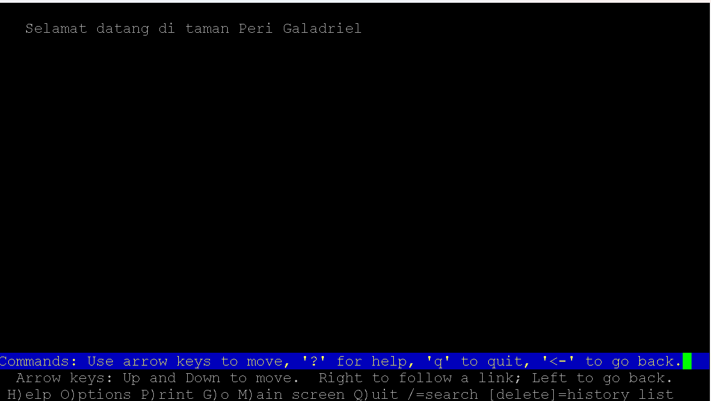

## Anggota Kelompok
| No | Nama                       | NRP         | Pembagian Tugas  |
|----|----------------------------|-------------|------------------|
| 1  | Aditya Reza Daffansyah     | 5027241034  | 1 - 10           | 
| 2  | I Gede Bagus Saka Sinatrya |	5027241088  | 11 - 20          | 

# Laporan Resmi Praktikum Jarkom

## Walkthrough Pengerjaan Praktikum Jarkom Modul 3
## Daftar Isi

- [Anggota Kelompok](#anggota-kelompok)
- [Daftar Isi](#daftar-isi)
- [Soal 1](#soal-1)
- [Soal 2](#soal-2)
- [Soal 3](#soal-3)
- [Soal 4](#soal-4)
- [Soal 5](#soal-5)
- [Soal 6](#soal-6)
- [Soal 7](#soal-7)
- [Soal 8](#soal-8)
- [Soal 9](#soal-9)
- [Soal 10](#soal-10)
- [Soal 11](#soal-11)
- [Soal 12](#soal-12)
- [Soal 13](#soal-13)
- [Soal 14](#soal-14)
- [Soal 15](#soal-15)
- [Soal 16](#soal-16)
- [Soal 17](#soal-17)
- [Soal 18](#soal-18)
- [Soal 19](#soal-19)
- [Soal 20](#soal-20)


### Soal 1
### Soal 2
### Soal 3
### Soal 4
### Soal 5
### Soal 6
### Soal 7
### Soal 8
### Soal 9
### Soal 10
### Soal 11
Musuh mencoba menguji kekuatan pertahanan Númenor. Dari node client, luncurkan serangan benchmark (ab) ke elros.<xxxx>.com/api/airing/:
- Serangan Awal: -n 100 -c 10 (100 permintaan, 10 bersamaan).
- Serangan Penuh: -n 2000 -c 100 (2000 permintaan, 100 bersamaan). Pantau kondisi para worker dan periksa log Elros untuk melihat apakah ada worker yang kewalahan atau koneksi yang gagal.
- Strategi Bertahan: Tambahkan weight dalam algoritma, kemudian catat apakah lebih baik atau tidak.

### Soal 12
Para Penguasa Peri (Galadriel, Celeborn, Oropher) membangun taman digital mereka menggunakan PHP. Instal nginx dan php8.4-fpm di setiap node worker PHP. Buat file index.php sederhana di /var/www/html masing-masing yang menampilkan nama hostname mereka. Buat agar akses web hanya bisa melalui domain nama, tidak bisa melalui ip.

Tujuan soal: Membangun tiga worker PHP (Galadriel, Celeborn, Oropher). Ini termasuk menginstal nginx dan php8.4-fpm , membuat file index.php yang menampilkan hostname , dan mengonfigurasi Nginx agar hanya bisa diakses melalui nama domain (memblokir akses via IP)

Pertama kita bisa masuk ke Galadriel melakukan download dengan menggunakan
```bash
apt-get update && apt-get install nginx php8.4-fpm -y
```

Kemudian kita membuat direktori web dan pesan untuk menampilkan hostnamenya 
```bash
# Membuat direktori web
mkdir -p /var/www/html

# Menulis konten PHP ke file 
echo "<?php echo 'Selamat datang di taman Peri ' . gethostname(); ?>" > /var/www/html/index.php

# Memberikan kepemilikan ke user web server (www-data)
chown -R www-data:www-data /var/www/html
```

Selanjutnya kita melakukan konfigurasi pada nginx (Domain-Only, Port Unik, Socket PHP)
```bash
cat <<EOF > /etc/nginx/sites-available/default
server {
    # Mendengarkan di port 8004 
    listen 8004 default_server;

    # 'server_name _' menangkap semua host yang tidak cocok
    server_name _;

    # Tolak semua atau kembalikan 404
    return 404;
}

# Server block ini hanya akan merespon request ke domain 'galadriel.K33.com'
server {
    # Mendengarkan di port 8004 
    listen 8004;

    server_name galadriel.K33.com;

    root /var/www/html;
    index index.php;

    location / {
      
    }

    # meneruskan request .php ke socket PHP-FPM 
    location ~ \.php$ {
        include snippets/fastcgi-php.conf;

        # Pastikan path socket ini benar
        fastcgi_pass unix:/run/php/php8.4-fpm.sock;
    }
}
EOF
```
Setelah itu kita bisa melakukan restart pada nginx
```bash
nginx -t
service nginx restart
service php8.4-fpm restart
```

Ulangin semua langkah langkah di atas di Celeborn dan Oropher dan sesuaikan port dan nama nya sesuai worker masing masing.

Kemudian kita bisa melakukan verifikasi
```bash
#verifikasi dari klien
# tes akses ip 
curl http://10.80.2.2:8004
```
Hasil dari test ip


```bash
# tes akses domain
lynx http://galadriel.K33.com:8004
```
Hasil dari test nama domain


### Soal 13
Setiap taman Peri harus dapat diakses. Konfigurasikan nginx di setiap worker PHP untuk meneruskan permintaan file .php ke socket php-fpm yang sesuai. Atur agar Galadriel mendengarkan di port 8004, Celeborn di 8005, dan Oropher di 8006.

Tujuan soal: Mengonfigurasi Nginx di setiap worker PHP untuk mendengarkan di port unik yang telah ditentukan (Galadriel 8004, Celeborn 8005, Oropher 8006) dan memastikan permintaan file .php diteruskan dengan benar ke socket php-fpm .

Pengerjaan nomor 13 sendiri sudah langsung termasuk ke nomor 12 karena kita sudah menambahkan port masing masing worker di konfigurasi nginx nya jadi kita harus menyertakan portnya saat melakukan verifikasi seperti pada test verifikasi nomor 12.

Kita bisa memverifikasi lagi menggunakan ini
```bash
#cukup verifikasi dengan klien
# Tes Galadriel
#jika tidak menggunakan port
curl http://galadriel.K33.com/

# jika menggunakan port
curl http://galadriel.K33.com:8004/
# Hasil: Selamat datang di taman Peri Galadriel

# Tes Celeborn
# jika tidak menggunakan port
curl http://celeborn.K33.com/

# jika menggunakan port
curl http://celeborn.K33.com:8005/
# Hasil: Selamat datang di taman Peri Celeborn

# Tes Oropher
# jika tidak menggunakan port
curl http://oropher.K33.com/

# jika menggunakan port
curl http://oropher.K33.com:8006/
# Hasil: Selamat datang di taman Peri Oropher
```

### Soal 14
Keamanan adalah prioritas. Terapkan Basic HTTP Authentication pada nginx di setiap worker PHP, sehingga hanya mereka yang tahu kata sandi (user: noldor, pass: silvan) yang bisa masuk.

Tujuan soal: Menerapkan Basic Authentication yang berfungsi untuk mengamankan ketiga worker PHP dengan menambahkan Basic HTTP Authentication (Otentikasi Dasar) Nginx. Hanya pengguna dengan kredensial user: noldor dan pass: silvan yang boleh masuk.

Pertama kita bisa masuk ke Galadriel dan lakukan instalasi (nantinya ulangin semua langkah langkah di bawah di Celeborn dan Oropher)
```bash
apt update && apt install apache2-utils -y
```

Setelah itu kita bisa membuat username dan passwordnya
```bash
htpasswd -cb /etc/nginx/.htpasswd noldor silvan
```

Kemudian kita masuk ke `nano /etc/nginx/sites-available/default` dan tambahkan baris ini sebelum lokasi dari file index.php
```bash
cat <<EOF > /etc/nginx/sites-available/default
server {
    # Mendengarkan di port 8004 
    listen 8004 default_server;

    # 'server_name _' menangkap semua host yang tidak cocok
    server_name _;

    # Tolak semua atau kembalikan 404
    return 404;
}

# Server block ini hanya akan merespon request ke domain 'galadriel.K33.com'
server {
    # Mendengarkan di port 8004 
    listen 8004;

    server_name galadriel.K33.com;

    root /var/www/html;

    # TAMBAHKAN INI 
    auth_basic "Area Terlarang Noldor & Silvan"; 
    auth_basic_user_file /etc/nginx/.htpasswd;

    index index.php;

    location / {
      
    }

    # meneruskan request .php ke socket PHP-FPM 
    location ~ \.php$ {
        include snippets/fastcgi-php.conf;

        # Pastikan path socket ini benar
        fastcgi_pass unix:/run/php/php8.4-fpm.sock;
    }
}
EOF
```

Setelah itu kita bisa melakukan restart pada nginx
```bash
nginx -t
service nginx restart
service php8.4-fpm restart
```

Ulangin langkah langkah di atas di Celeborn dan Oropher.

Kemudian kita bisa melakukan verifikasi dengan 
```bash
# verifikasi dari klien
# Tes Gagal (Tanpa Otentikasi)
curl http://galadriel.K33.com:8004/
```

Hasil dari tanpa otentikasi


Kemudian kita bisa melakukan test dengan otentikasi
```bash
# Tes Berhasil (Dengan Otentikasi)
curl --user "noldor:silvan" http://galadriel.K33.com:8004/

# Masukkan username dan password 
lynx http://galadriel.K33.com:8004
```

Hasil dengan otentikasi


### Soal 15
Para Peri ingin tahu siapa yang mengunjungi taman mereka. Modifikasi konfigurasi Nginx di worker PHP untuk menambahkan header X-Real-IP yang akan diteruskan ke PHP. Ubah file index.php untuk menampilkan alamat IP pengunjung asli saat ini.

Tujuan soal: Memodifikasi worker PHP agar dapat menampilkan alamat IP asli pengunjung. Ini melibatkan pengeditan Nginx untuk meneruskan header X-Real-IP dan pengeditan index.php untuk membacanya.

Pertama kita masuk ke galadriel dan melakukan pengeditan pada file index.php kita (Ulangin semua langkah langkah di bawah pada Celeborn dan Oropher)
```bash
# Masuk ke index.php
nano /var/www/html/index.php

# hapus konten lama dan ganti dengan ini
<?php
echo 'Selamat datang di taman Peri ' . gethostname() . '<br><br>';

#Menampilkan IP yang dilihat langsung oleh server (akan menjadi IP Pharazon)
echo 'IP Pengunjung (REMOTE_ADDR): ' . $_SERVER['REMOTE_ADDR'] . '<br>';

#Memeriksa apakah header X-Real-IP (IP Asli) dikirim oleh proxy
if (isset($_SERVER['HTTP_X_REAL_IP'])) {
    echo 'Alamat IP pengunjung ASLI (X-Real-IP): ' . $_SERVER['HTTP_X_REAL_IP'];
} else {
    echo 'Alamat IP pengunjung ASLI (X-Real-IP): (Tidak terdeteksi)';
}
?>
```

Selanjutnya kita bisa masuk ke `nano /etc/nginx/sites-available/default` dan menambahkan
```bash

# cari blok location / dan tambahkan dengan ini
location ~ \.php$ {
    include snippets/fastcgi-php.conf;
    fastcgi_pass unix:/run/php/php8.4-fpm.sock;

    # TAMBAHKAN BARIS INI
    # Baris ini mengambil header 'X-Real-IP' dari request (variabel: $http_x_real_ip) dan meneruskannya ke PHP
    fastcgi_param X-Real-IP $http_x_real_ip;
}
```

Setelah itu kita bisa melakukan restart pada nginx
```bash
nginx -t
service nginx restart   
service php8.4-fpm restart
```

Ulangi seluruh langkah langkah di atas di Celeborn dan Oropher

Yang terakhir kita bisa melakukan verifikasi dengan klien 
```bash
curl --user "noldor:silvan" http://galadriel.K33.com:8004
```

Hasil setelah test


### Soal 16
Raja Númenor terakhir yang ambisius, Pharazon, mencoba mengawasi taman-taman Peri. Konfigurasikan Nginx di Pharazon sebagai reverse proxy. Buat upstream Kesatria_Lorien berisi alamat ketiga worker PHP. Atur agar permintaan ke pharazon.<xxxx>.com diteruskan ke backend, dan pastikan konfigurasi Nginx di sPharazon juga meneruskan informasi Basic Authentication yang dimasukkan pengguna ke worker.

Tujuan soal: mengatur Pharazon sebagai reverse proxy (load balancer) untuk ketiga worker PHP (Galadriel, Celeborn, Oropher) . Konfigurasi ini juga harus bisa meneruskan informasi Basic Authentication dari client ke worker.

### Soal 17
Dari node client, lakukan benchmark ke pharazon.<xxxx>.com, jangan lupa menyertakan kredensial autentikasi. Amati distribusi beban ke para worker. Kemudian, simulasikan salah satu taman Peri runtuh (misal: service nginx stop di Galadriel) dan jalankan lagi benchmark. Apakah Pharazon masih bisa mengarahkan pengunjung ke taman yang tersisa? Periksa log Pharazon.

Tujuan soal: menguji ketahanan Pharazon. Kita harus melakukan benchmark saat semua worker hidup, kemudian mematikan salah satu worker (Galadriel), dan membuktikan (melalui log dan tes ulang) bahwa Pharazon masih bisa mengarahkan lalu lintas ke worker yang tersisa dan kita lakukan pengecekan di log pharazon.

### Soal 18
Kekuatan Palantir sangat vital. Untuk melindunginya, konfigurasikan replikasi database Master-Slave menggunakan MariaDB. Jadikan Palantir sebagai Master. Konfigurasikan Narvi sebagai Slave yang secara otomatis menyalin semua data dari Palantir. Buktikan replikasi berhasil dengan membuat tabel baru di Master dan memeriksanya di Slave.

### Soal 19
Gelombang serangan dari Mordor semakin intens. Implementasikan rate limiting pada kedua Load Balancer (Elros dan Pharazon) menggunakan Nginx. Batasi agar satu alamat IP hanya bisa melakukan 10 permintaan per detik. Uji coba dengan menjalankan ab dari satu client dengan konkurensi tinggi (-c 50 atau lebih) dan periksa log Nginx untuk melihat pesan request yang ditolak atau ditunda karena rate limit.

Tujuan soal: Melindungi kedua load balancer (Elros dan Pharazon) dari serangan sederhana. Kita harus menerapkan batas 10 permintaan per detik per IP dan mengujinya menggunakan ab dengan konkurensi tinggi.

### Soal 20
Beban pada para worker semakin berat. Aktifkan Nginx Caching pada Pharazon untuk menyimpan salinan halaman PHP yang sering diakses. Gunakan curl pada domain nama Pharazon dari client untuk memeriksa response header. Buktikan bahwa permintaan kedua dan seterusnya untuk halaman yang sama mendapatkan status HIT dari cache dan tidak lagi membebani worker PHP.

Tujuan soal: Mengurangi beban pada worker PHP dengan mengaktifkan caching di Pharazon. Kita harus membuktikan bahwa cache berfungsi dengan menggunakan curl untuk memeriksa response header dan mencari status HIT .
